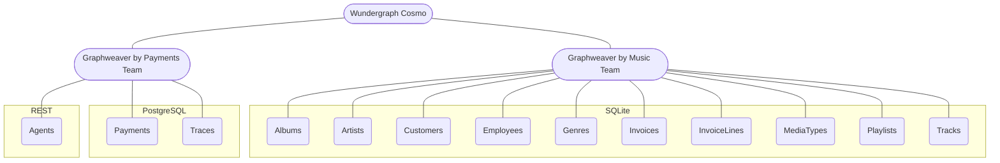

# Graphweaver Federation Demo

This repo demonstrates using two different [Graphweaver](https://graphweaver.com) instances as subgraph providers, then federating them using [Wundergraph Cosmo](https://wundergraph.com/).

Our example organisation has two different teams:

- Music Team: This team controls Albums, Artists, Tracks, Invoices, etc. The tables here come from the [Chinook example database](https://github.com/lerocha/chinook-database).
- Payments Team: This team controls Payments (which happen on Invoices from the Music Team) and Agents that own the payments. Agents are characters from the [Star Wars REST API](https://swapi.info/).

This is what it looks like all together:



To get started:

1. Clone this repository
2. Install [node](https://nodejs.org/en). We recommend using [nvm](https://github.com/nvm-sh/nvm) or [nvm-windows](https://github.com/coreybutler/nvm-windows) to do this.
3. Install [pnpm](https://pnpm.io/).
4. Go to each directory and run the setup instructions in that directory, starting with the subgraphs.
5. Once you've completed the steps in each directory, you're up! You can test that both subgraphs are responding with the following query:

```graphql
{
  payments {
    owner {
      name
    }
    invoice {
      billingCity
    }
    amount
  }
}
```

To resolve this query, Cosmo will go to the payments graph, retrieve the payment and owner information, then will use the ID it got from the payment to go to the music graph and retrieve invoice information.
